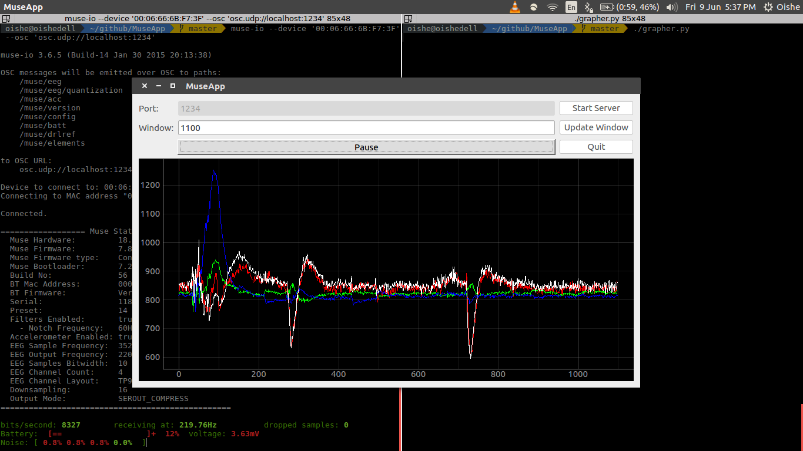

# Muse App
This is a project I created to teach myself how to interact with the Muse using python. This programm will connect and graph all 4 electrodes.
I will expand the features according to the specific future project.

## Current Features Available
- Muse emulator
  - Mimics the 4 EEG electrodes for testing
- Muse Grapher
  - Choose which port to connect to
  - Window resizing to fit more or less points
  - Pause and restart the graph
  - Autoscaling features for all 4 electrodes

| Region | Colour |
|---|---|
|left ear |red|
|left forehead| green|
|right forehead| blue|
|right ear| white|

## Dependencies
You'll need to install the following to get the program to work.
Installation instructions are available on the websites.
- [PyLiblo:](http://das.nasophon.de/pyliblo/)
Allows python to communicate using OSC
  - Python 2.7
  - Cython
  - Liblo
- [pyqtgraph:](http://www.pyqtgraph.org/)
Used to graph and create the Graphical User Interface
  - PyQt4
  - NumPy
- [Muse Research Tools:](http://developer.choosemuse.com/research-tools)
Used to connect to the muse over bluetooth and stream in OSC format
  - MuseIO

## Run the following
#### Emulator
This is if you want to run tests but don't want to connect with a muse. Default portnumber is 1234 if no extra argument is added.

`python ./emulator.py 1234`

or simply

`./emulator.py`

#### Muse
If you have a muse then you should connect with it over bluetooth to find the MAC address. Then you'll have to use MuseIO to connect to the muse. Here's their [example.](http://developer.choosemuse.com/research-tools/museio)
The code below is to connect to port 1234.

`muse-io --device '<MACaddresshere>' --osc 'osc.udp://localhost:1234'`

#### Grapher
This will connect to which ever port you specified in either the emulator or the muse.

`python ./grapher.py`

or simply

`./grapher.py`

## Next Steps
These will be in the form of features added to better analyze the signal.
- Checkboxes to display only specific channels
- Recording and storage to csv files with user inputed names
- Frequency spectrum
  - Window-size slider
  - Continous graph
  - Histogram with major brain waves
- Noise indicator
  - Electrode contact
  - Signal Variance threshold

The above features will only be added to help users graph and record data. This is strictly for learning purposes as new users can see where to start and create there own Muse inspired project. Future projects will fork this repository as the base.
